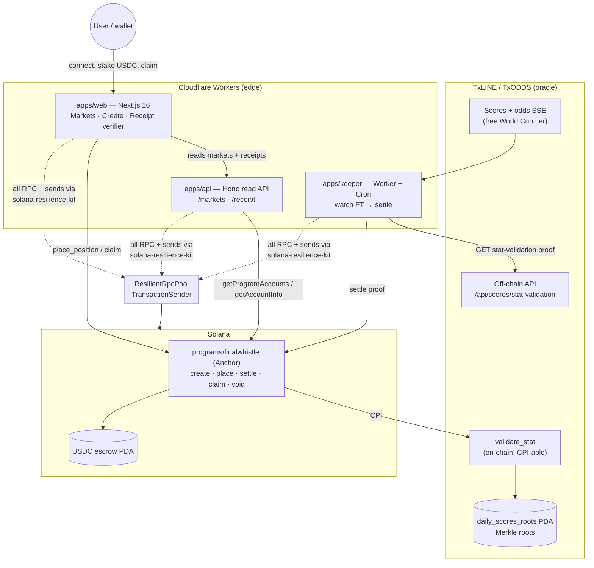
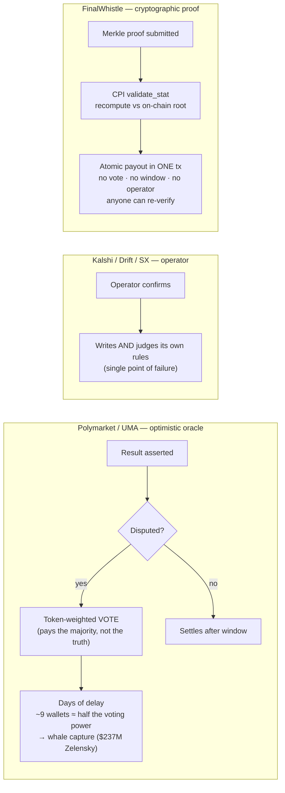

# FinalWhistle — Diagrams

## System architecture



## Settlement sequence

```mermaid
sequenceDiagram
  autonumber
  participant K as Keeper (Worker)
  participant T as TxLINE API
  participant S as FinalWhistle.settle
  participant V as TxLINE.validate_stat
  participant R as daily_scores_roots PDA
  participant E as USDC escrow

  K->>T: GET /api/scores/stat-validation (fixtureId, seq, statKey[,statKey2])
  T-->>K: three-stage Merkle proof + statToProve (value, period)
  K->>S: settle(proof)  [via solana-resilience-kit, +1.4M CU]
  Note over S: bind proof to market\n(stat_key / period / fixture / op)
  S->>V: CPI validate_stat(ts=minTimestamp, summary, proofs, YES predicate, statA[,statB,op])
  V->>R: recompute Merkle path vs on-chain root
  alt proof tampered / invalid
    V-->>S: REVERT  ⇒ settle reverts (escrow untouched)
  else proof valid
    V-->>S: return_data = bool (predicate held?)
    S->>S: winning_side = bool ? YES : NO
    S->>E: transfer fee → treasury ; status = Resolved
  end
  Note over K,E: later — winners call claim() → pro-rata USDC ; receipt re-verifies in browser
```

## Oracle comparison


